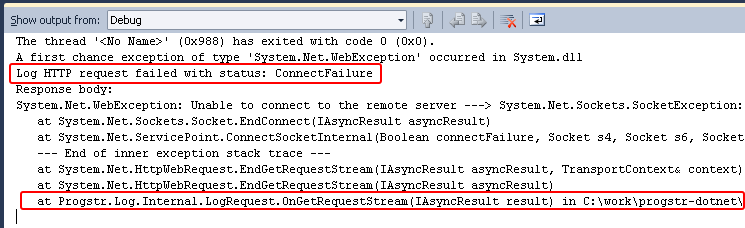

Table of Contents
=================
* [Introduction](#introduction)
* [Installation](#installation)
* [Configuration](#configuration)
* [Getting Started](#getting_started)
* [Troubleshooting](#troubleshooting)
* [Supported Platforms](#supported_platforms)

Introduction
=====================
Progstr.log is a service that collects and manages programmer log entries in the cloud. Most applications log errors and special external events generated by users or third party systems. Logging all can be both simple or complex and might grow into a full-blown application. Progstr.log tries to do that for you. It is simple to use and gets you going in minutes, but it also takes care of the heavy lifting of involved in handling the log data your appliation generates. Our service takes away the pain of complex logging system configurations, provides a centralized location for all your log entries and helps you analyze the data you’ve collected over time. **progstr-dotnet** is the Microsoft .NET client library that collects log entries and transports them to the Progstr data store.

Installation
============
The easiest way to get the *Progstr.Log* library into your project is to use the [NuGet package](http://nuget.org/List/Packages/Progstr.Log) from within Visual Studio. It will download the library to your project folder and automatically add a reference.

You can also manually [download](https://github.com/progstr/progstr-dotnet/downloads) the latest version of the client library. The library itself is free and open-source and its source code [is available](https://github.com/progstr/progstr-dotnet) on GitHub.

*Progstr.Log.dll* is a regular .NET assembly that you need to drop in your project folder and refer from your application. 

> 

Configuration
=============

[Sign up](https://app.progstr.com/signup) for the progstr.log service and get your API token from the account *Settings* page. That token is used to identify you against the service. Keep it secret and do not share it with anyone unless you want to let them log messages on your behalf.
Download the binary distribution or compile progstr-dotnet from source. Copy *Progstr.Log.dll* to your project and add a reference.

Now that you have the library added to your project, you need to configure the API token by adding a "progstr.log.apitoken" entry to the `appSettings` section in your application config file (or the root web.config file for your web application):


<appSettings>
    <add key="progstr.log.apitoken" value="6f413b64-a8e1-4e25-b9e6-d83acf26ccba" />
</appSettings>


Alternatively, if you don't want to tinker with configuration files, you can configure the library in code. Just set the `LogSettings.ApiToken` property before you start logging, best done when your application starts.


LogSettings.ApiToken = "6f413b64-a8e1-4e25-b9e6-d83acf26ccba";


Note that if you mix code-based configuration with config file settings, the code-based `LogSettings` properties take precedence over the ones in your application config file.

Getting Started
-------------------------
There are four log severity levels that you can use to log events of different importance:

* *Info*: used to log general information events that can be used for reference or troubleshooting if needed.
* *Warning*: something odd happened and somebody needs to know about it.
* *Error*: something failed and needs to be fixed.
* *Fatal*: the entire application or a critical part of it is not working at all.

To log an event you need to obtain an object implementing the `ILog` interface and call some of its Info/Warning/Error/Fatal methods. The easiest way to do that is to use the `Log()` extension method:


using Progstr.Log;
...
...
this.Log().Info(message);
...
this.Log().Warning(message);
...
this.Log().Error(message);
...
this.Log().Fatal(message);


**Note the `using Progstr.Log;` line above. It is required by the compiler in order for the `Log()` method to work.**

Most logging libraries require that you initialize a log object with the current class and store it in a static field in that class where you can reuse it. We need a reference to that class, so that we can use its full name as a log source and easily distinguish which message got logged from which class. Modern C# lets us hide that complexity away by using generics and extension methods.

On some occasions it is not possible to use the `Log()` extension method. The most common scenario would be when logging from a static method. In that case, you can obtain an `ILog` object by calling the `Logs.Get()` static method:


using Progstr.Log;
...
...
Logs.Get<MyClass>().Info(message);


Troubleshooting
------------------------
Of course, bad things do happen even to the best logging tools. A typical situation would be a bad or missing API token or a network error (say our server is unreachable due to a network or a firewall configuration problem). We can't have a logging library throw exceptions all over the place and break your application if the network goes down. That's why we do nothing on the surface. Our library silently complains by logging a debug message that will be visible only if the program has a debugger attached. So, if nothing happens in your app and you don't see your logs reaching our service, launch your application in Visual Studio's debugger and check the Debug log in the Output window. Look for errors originating from the Progstr.Log classes such as:

> 

Supported platforms
------------------------
* Microsoft .NET 3.5 and later
* Mono 2.6.7 and later.

Feedback
--------
* If you have a feature suggestion, enhancement idea, or a bug report for the client library, please open a ticket on the project [issue tracker](https://github.com/progstr/progstr-dotnet/issues).
* For general problems or inquiries regarding integrating the library in your project or the *progstr.log* service, please contact [support](http://support.progstr.com).
